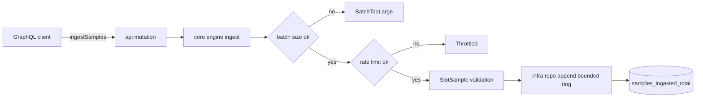
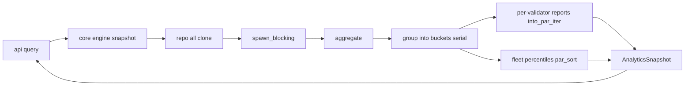

# AgaveLens

**Validator-internals analytics for the Agave/Solana validator client — parallelised
percentile aggregation served over GraphQL.**

AgaveLens ingests slot-level validator telemetry (slot production time, vote latency,
skip/produce outcome, leader identity) and turns it into actionable fleet analytics:
skip-rate per validator, slot-time and vote-latency percentiles (p50/p90/p99), worst-offender
rankings, and per-epoch summaries. The heavy aggregation runs **in parallel with `rayon`**
inside a `spawn_blocking` task so percentile math over hundreds of thousands of samples never
blocks the async runtime.

It is built to the same production bar as the rest of this workspace — hexagonal
architecture, no `unwrap`/`panic` on runtime paths, resilience guards on every ingest boundary,
structured tracing, Prometheus metrics, and a full test + benchmark suite.

> Part of a five-project Solana-infrastructure portfolio. AgaveLens is the **read-mostly
> analytics** member: it deliberately has **no streaming subscription** (unlike the other four)
> and headlines **CPU-bound parallelism** rather than network I/O.

---

## Table of Contents

- [Why this design](#why-this-design)
- [Architecture](#architecture)
  - [Ingest → aggregate pipeline](#ingest--aggregate-pipeline)
  - [Component details](#component-details)
  - [Architecture flows](#architecture-flows)
- [Quick start](#quick-start)
  - [`analyze` — real output](#analyze--real-output)
- [GraphQL API](#graphql-api)
  - [Ingest a batch](#ingest-a-batch)
  - [Query analytics](#query-analytics)
- [Performance & the parallel crossover](#performance--the-parallel-crossover)
- [Profiling & flame graph](#profiling--flame-graph)
- [Resilience model](#resilience-model)
- [Observability](#observability)
- [CLI](#cli)
- [Development](#development)
  - [Test results](#test-results)
  - [Docker](#docker)
- [Status & limitations](#status--limitations)
- [License](#license)

---

## Why this design

| Decision | Rationale |
|---|---|
| **`rayon` data-parallel percentile sorting** | Grouping samples per validator is a cheap linear pass, but the percentile math — independent per-validator sorts plus two fleet-wide sorts — is the CPU-bound hot path. Per-validator reports are built with `into_par_iter()` and the fleet-wide vectors with `par_sort_unstable()`, scaling across all cores once the dataset is large enough to amortise fork/join. |
| **Adaptive serial/parallel threshold** | Parallelism isn't free. Below a measured ~500k-sample crossover the serial path is faster, so `aggregate()` auto-selects it; above the crossover rayon wins and the margin widens with size and core count. |
| **`spawn_blocking` around the rayon call** | rayon is synchronous and CPU-bound. Wrapping `aggregate()` in `tokio::task::spawn_blocking` keeps the Tokio worker threads free to serve other GraphQL requests. |
| **Bounded sample store (ring buffer)** | A `VecDeque` capped at `max_samples` evicts oldest-first. Memory is provably bounded regardless of ingest volume — no eviction loop, no TTL bookkeeping. |
| **Token-bucket ingest rate limiter** | Protects the node from ingest floods. A clock-driven `RateLimiter` refills at a configurable rate; over-limit batches fail fast with `throttled`. |
| **Batch-size guard** | Each ingest call is capped (`max_batch`, default 10k) so a single request can't monopolise CPU or memory; oversize batches fail with `batch_too_large`. |
| **No subscription** | Analytics are pull-based. A snapshot is a point-in-time reduction; clients poll `snapshot`/`worstValidators` rather than subscribe. This keeps the surface small and cache-friendly. |
| **Newtypes everywhere** | `Slot`, `Epoch`, `ValidatorId` are validated newtypes — an invalid sample cannot be represented in the domain. |

---

## Architecture

Hexagonal / ports-and-adapters. Dependencies point inward; the domain core knows nothing
about GraphQL, axum, or the concrete store.

```
                           ┌──────────────────────────────────────────┐
                           │            agavelens-node (bin)           │
                           │  CLI (serve / analyze) · axum · telemetry │
                           └───────────────┬──────────────────────────┘
                                           │ composes
              ┌────────────────────────────┼────────────────────────────┐
              │                            │                            │
      ┌───────▼────────┐          ┌────────▼────────┐          ┌────────▼────────┐
      │ agavelens-api  │          │ agavelens-infra │          │ agavelens-core  │
      │ async-graphql  │          │ memory store    │          │ engine · guards │
      │ schema/types   │          │ sample generator│          │ rayon aggregate │
      └───────┬────────┘          └────────┬────────┘          └────────┬────────┘
              │                            │  implements ports          │
              │                            └────────────┬───────────────┘
              │                                         │ depends on
              └─────────────────────────────────────────▼
                                  ┌────────────────────────────┐
                                  │       agavelens-types       │
                                  │ Slot · Epoch · ValidatorId  │
                                  │ SlotSample · Percentiles    │
                                  │ reports · errors (no I/O)   │
                                  └────────────────────────────┘
```

| Crate | Responsibility | Key deps |
|---|---|---|
| `agavelens-types` | Pure domain: validated ids, `SlotSample`, `Percentiles`, `SkipStats`, reports, error enums. No I/O. | `chrono`, `serde`, `thiserror` |
| `agavelens-core` | Ports (`SampleRepository`, `Clock`), the `AnalyticsEngine`, resilience guards (`RateLimiter`), config, and the **rayon aggregator**. | `rayon`, `async-trait`, `parking_lot`, `metrics` |
| `agavelens-infra` | Adapters: bounded `MemorySampleRepository`, deterministic `SampleGenerator` (no `rand`). | `parking_lot`, `chrono` |
| `agavelens-api` | `async-graphql` schema — query + mutation roots, input/output objects. | `async-graphql` |
| `agavelens-node` | Composition root + binary: CLI, axum wiring, tracing, Prometheus, graceful shutdown, `analyze` job, criterion bench. | `axum`, `clap`, `tokio`, `metrics-exporter-prometheus` |

### Ingest → aggregate pipeline

```
ingestSamples ─▶ batch-size guard ─▶ rate limiter ─▶ MemorySampleRepository (bounded ring)
                  (batch_too_large)    (throttled)              │
                                                                ▼
snapshot ◀── spawn_blocking( rayon aggregate ) ◀── repo.all()  read
             serial group → buckets
             per-validator reports (into_par_iter) + fleet percentiles (par_sort)
```

### Component details

Every component below maps to a box in the diagram. Dependencies only ever point *inward*
(`node → api / infra / core → types`); each crate carries `#![forbid(unsafe_code)]`.

#### `agavelens-types` — domain vocabulary (zero I/O)

| Module | Key items | Responsibility |
|---|---|---|
| `ids.rs` | `Slot`, `Epoch`, `ValidatorId` | Validated newtypes. `ValidatorId::new` rejects empty/oversized strings; `Slot::epoch(slots_per_epoch)` derives the epoch. Illegal ids are unrepresentable. |
| `sample.rs` | `SlotSample` | The atomic ingest unit — slot, leader, slot-time, vote-latency, skip flag, optional epoch. The constructor range-checks every field. |
| `stats.rs` | `Percentiles`, `SkipStats` | `Percentiles::from_sorted` reduces a pre-sorted slice to p50/p90/p99/max/mean — the type the parallel sorts feed. |
| `report.rs` | `ValidatorReport`, `AnalyticsSnapshot`, `EpochSummary` | Immutable aggregation outputs returned over GraphQL. |
| `error.rs` | `TypesError` | Typed validation errors, each carrying a stable `.code()`. |

#### `agavelens-core` — engine, ports & guards (inside the hexagon)

| Module | Key items | Responsibility |
|---|---|---|
| `ports.rs` | `SampleRepository`, `Clock` | The hexagonal ports the core depends on; adapters live in `infra`. |
| `aggregate.rs` | `aggregate()`, `group()`, `Bucket`, `report_for`, `summarize_epoch` | The **rayon hot path**. `group()` is a serial linear pass into per-validator `Bucket`s; the sort-heavy percentile phase parallelises (`into_par_iter`, `par_sort_unstable`). Pure and deterministic. |
| `engine.rs` | `AnalyticsEngine` | Orchestrates guard → repo → aggregate and wraps `aggregate()` in `spawn_blocking`. |
| `guard.rs` | `RateLimiter`, batch guard | Token-bucket ingest limiter + batch-size cap on a pluggable `Clock`. |
| `config.rs` | `AnalyticsConfig` | All tunables: `max_samples`, `max_batch`, ingest capacity/refill, `parallel_threshold`. |
| `error.rs` | `CoreError` | `BatchTooLarge`, `Throttled`, `InvalidSample`, … each mapped to a GraphQL error code. |

#### `agavelens-infra` — adapters (outside the hexagon)

| Module | Key items | Responsibility |
|---|---|---|
| `repo.rs` | `MemorySampleRepository` | Bounded `VecDeque` ring (oldest-first eviction) implementing `SampleRepository`; memory bounded by construction. |
| `generator.rs` | `SampleGenerator` | Deterministic synthetic telemetry (no `rand`) for `analyze`, benches and tests. |

#### `agavelens-api` — GraphQL surface

| Module | Key items | Responsibility |
|---|---|---|
| `schema.rs` | schema builder | Assembles the schema and applies `limit_depth(12)` + `limit_complexity(256)`. |
| `query.rs` | `QueryRoot` | `sampleCount`, `skipRate`, `snapshot`, `worstValidators`, `validatorReport`, `epochSummary`. |
| `mutation.rs` | `MutationRoot` | `ingestSamples` — the only write path. |
| `types.rs` | GraphQL I/O objects | `SampleInput` plus percentile/report output objects mapping domain types to the wire. |

#### `agavelens-node` — composition root (binary)

| Module | Key items | Responsibility |
|---|---|---|
| `main.rs` | CLI entry | Parses `serve` / `analyze` via `clap`. |
| `config.rs` | node config | Merges CLI/env into `AnalyticsConfig`. |
| `startup.rs` | axum wiring | Builds engine + schema, mounts `/graphql` + `/metrics`, graceful shutdown. |
| `telemetry.rs` | observability | `tracing` (text/JSON) + Prometheus recorder. |
| `analyze.rs` | `analyze` job | One-shot offline aggregation report (no server). |

### Architecture flows

Five end-to-end flows exercise the system; each names the real modules/functions on the path.

**1 · Ingest flow** (write — `mutation ingestSamples`)



Untrusted volume passes the batch-size guard, then the token-bucket rate limiter, then newtype
validation, and is appended to the bounded ring (oldest-first eviction). Every rejection is a
typed `CoreError` surfaced as a coded GraphQL error and counted in
`agavelens_batches_rejected_total{reason}`.

**2 · Snapshot / aggregate flow** (read — `query snapshot` / `worstValidators`)



The engine snapshots the ring, hands it to `spawn_blocking` (so Tokio workers stay free), and
`aggregate()` runs: a cache-friendly **serial** `group()` into per-validator buckets, then the
CPU-bound **parallel** percentile phase. Above `parallel_threshold` (500k) rayon is used; below
it the identical code path runs serially.

**3 · Targeted query flows** — `validatorReport(validator)` calls `aggregate::report_for`;
`epochSummary(epoch)` calls `summarize_epoch`; `sampleCount` / `skipRate` are O(n) reads over the
ring. All are read-only and hold the store lock only long enough to clone the working set.

**4 · `analyze` CLI flow** (offline) — `node::analyze` drives `SampleGenerator::generate` →
`engine.ingest` → `aggregate()` → formatted report. No server, no network: the same core path
the API uses, measured for the throughput numbers above.

**5 · Bootstrap / serve flow** — `main` → `telemetry::init` → build `AnalyticsEngine` + schema →
`startup` mounts the axum routes → serve until SIGINT/SIGTERM triggers graceful shutdown.

---

## Quick start

```bash
# Build everything
cargo build --release

# 1) One-shot batch analytics over synthetic telemetry (no server needed)
./target/release/agavelens-node analyze --slots 1000000 --validators 1500 --skip-rate 8 --top 5

# 2) Serve the GraphQL analytics API
./target/release/agavelens-node serve --port 8080
# GraphiQL playground:  http://localhost:8080/graphql
```

### `analyze` — real output

```text
AgaveLens analyze — 1000000 slots across 1500 validators (8% baseline skip)

overall:
  validators seen  : 1500
  skip rate        : 19.98%  (199789 of 1000000 slots)
  slot time ms     : p50 473  p90 541  p99 579  max 587
  vote latency ms  : p50 127  p90 168  p99 191  max 195

worst 5 validators by skip rate:
  validator        led       skip    slot p50    vote p99
  val-0232         656     35.67%        437         167
  val-0032         637     35.64%        492         167
  val-1364         660     35.61%        529         194
  val-0932         710     35.07%        434         166
  val-1032         668     35.03%        474         166

aggregation:
  elapsed          : 187.833 ms
  throughput       : 5323885 samples/s
```

> **~5.3M samples/s** end-to-end (ingest + bounded-store write + full parallel aggregation)
> over 1M slots and 1500 validators on an 8-core developer laptop. See the performance section
> for the serial/parallel crossover that drives the adaptive path selection.

---

## GraphQL API

Endpoint: `POST /graphql` (GraphiQL on `GET /graphql`).

### Ingest a batch

```graphql
mutation {
  ingestSamples(samples: [
    { slot: 10, leader: "val-aaa", slotTimeMs: 420, voteLatencyMs: 130, skipped: false },
    { slot: 11, leader: "val-aaa", slotTimeMs: 500, voteLatencyMs: 160, skipped: true  },
    { slot: 12, leader: "val-bbb", slotTimeMs: 450, voteLatencyMs: 140, skipped: false }
  ]) {
    accepted
    totalStored
  }
}
```

`epoch` is optional on each sample; when omitted it is derived from the slot via the configured
slots-per-epoch (default 432,000).

### Query analytics

```graphql
query {
  sampleCount
  skipRate
  snapshot {
    totalSamples
    validatorsSeen
    skipRate
    slotTime    { p50 p90 p99 max mean }
    voteLatency { p50 p90 p99 max mean }
  }
  worstValidators(limit: 5) { validator slotsLed skipRate slotTime { p99 } }
  validatorReport(validator: "val-aaa") { slotsLed slotsSkipped skipRate }
  epochSummary(epoch: 0) { samples skipRate slotTimeP99 voteLatencyP99 }
}
```

A ready-to-import Postman collection lives in [`postman/`](postman/AgaveLens.postman_collection.json).

---

## Performance & the parallel crossover

`aggregate()` adaptively chooses serial vs parallel based on input size, because **parallelism
is not free** — rayon's fork/join and parallel-sort coordination only pay off once there's
enough work. The criterion benchmark (`benches/aggregate_bench.rs`, 1,500-validator fleet)
measures the crossover on an 8-core laptop:

| Samples | Serial | Parallel | Winner |
|--------:|-------:|---------:|:------|
| 100,000 | 17.7 Melem/s | 9.7 Melem/s | serial (2.4×) |
| 200,000 | 17.3 Melem/s | 12.8 Melem/s | serial |
| 500,000 | 16.5 Melem/s | 16.6 Melem/s | ~even (crossover) |
| 1,000,000 | 15.8 Melem/s | 18.3 Melem/s | **parallel (1.16×)** |

The parallel margin widens with sample volume, validator count, and core count. The default
`parallel_threshold` is set to **500,000** (the measured crossover): smaller aggregations run
serially where that is genuinely faster, and only large-window analysis goes parallel. This is
an honest, measured tuning decision rather than "parallel everywhere".

```bash
cargo bench -p agavelens-node          # reproduce the table above
```

---

## Profiling & flame graph

The aggregation hot path is profiled in-process with the [`pprof`](https://github.com/tikv/pprof-rs)
sampling profiler wired into the criterion bench — **no `perf`, root, or kernel tuning required**
(it works inside WSL2/containers where `perf` usually does not). A `SIGPROF` timer samples the
call stack at 1 kHz and [`inferno`](https://github.com/jonhoo/inferno) renders the SVG.

[](docs/flamegraph.svg)

> The inline image is a snapshot — open [`docs/flamegraph.svg`](docs/flamegraph.svg) directly for
> the interactive, zoomable version.

Regenerate it any time:

```bash
cargo bench -p agavelens-node --bench aggregate_bench -- --profile-time 10 'parallel/1000000'
cp target/criterion/aggregate/parallel/1000000/profile/flamegraph.svg docs/flamegraph.svg
```

**Reading the graph** (1M samples, 1,500 validators, parallel path; width = share of on-CPU
samples). `agavelens_core::aggregate::aggregate` dominates and splits into the two stacks the
design predicts:

- **`group()` — serial.** A linear pass building per-validator `Bucket`s. The visible
  `ValidatorId::{hash,eq,clone}` frames are the `HashMap` keying cost — exactly why grouping is
  *not* parallelised (a concurrent map-merge measured slower).
- **`Bucket::into_report` → `Percentiles::from_sorted` — parallel.** The CPU-bound sorts
  (`par_sort_unstable`, `sort_by`, `small_sort`) fan out across the `rayon` worker frames
  (`MapFolder::consume_iter`, `StackJob::execute`) — this is where multi-core scaling comes from.

The picture confirms the headline decision — *group serially, parallelise the sorts* — and shows
the `HashMap` keying and the percentile sorts as the two real cost centres.

---

## Resilience model

AgaveLens guards the ingest boundary — the only place untrusted volume enters — and keeps memory
bounded by construction. It deliberately uses **lighter** resilience than the network-facing
services in this workspace (no circuit breaker): there is no flaky downstream to trip on.

| Guard | Mechanism | Failure mode |
|---|---|---|
| **Batch-size guard** | Reject batches over `max_batch` (default 10,000) before any work | `CoreError::BatchTooLarge` → GraphQL error `batch_too_large` |
| **Rate limiter** | Token bucket (`ingest_capacity` tokens, `ingest_refill_per_sec`) on a pluggable `Clock` | `CoreError::Throttled` → GraphQL error `throttled` |
| **Bounded store** | `VecDeque` capped at `max_samples`; oldest-first eviction | Memory provably bounded; no OOM under sustained ingest |
| **Validation at the boundary** | Newtype constructors (`ValidatorId::new`, `SlotSample::new`) reject empty/oversized/out-of-range fields | `InvalidSample` → typed GraphQL error with `.code()` |
| **Query depth/complexity limits** | `async-graphql` `limit_depth(12)` + `limit_complexity(256)` | Hostile queries rejected before execution |
| **Non-blocking aggregation** | `spawn_blocking` wraps the rayon reduce | Tokio workers stay responsive under heavy aggregation |

All limits are configurable through `AnalyticsConfig`.

---

## Observability

Structured `tracing` (text or `--log-json`) plus Prometheus metrics on `GET /metrics`:

| Metric | Type | Meaning |
|---|---|---|
| `agavelens_samples_ingested_total` | counter | Samples accepted into the store |
| `agavelens_batches_rejected_total{reason}` | counter | Rejected batches by reason (`batch_too_large`, `throttled`) |
| `agavelens_snapshots_total` | counter | Aggregation snapshots computed |
| `agavelens_graphql_requests_total` | counter | GraphQL HTTP requests served |

---

## CLI

```text
agavelens-node <COMMAND>

Commands:
  serve     Serve the GraphQL analytics API over HTTP
  analyze   Run a one-shot batch analytics job over synthetic telemetry and print a report

Global:
  --log-json                 Emit JSON logs            [env: AGAVELENS_LOG_JSON]

serve:
  --host <HOST>              Bind address (def 127.0.0.1)        [env: AGAVELENS_HOST]
  --port <PORT>              Bind port (def 8080)                [env: AGAVELENS_PORT]
  --samples-capacity <N>     Bounded store size (def 200000)     [env: AGAVELENS_MAX_SAMPLES]

analyze:
  --slots <N>                Slots of synthetic telemetry (def 50000)
  --validators <N>           Validator set size (def 64)
  --skip-rate <PCT>          Baseline skip percentage (def 8)
  --top <N>                  Worst-N validators to list (def 10)
  --epoch <E>                Also print a specific epoch summary
```

---

## Development

```bash
cargo fmt --all
cargo clippy --workspace --all-targets --all-features -- -D warnings
cargo test --workspace
cargo bench -p agavelens-node          # criterion: parallel vs serial aggregate
```

- **68 tests** (types 22, core 22, infra 10, api 5, node 9), clippy-clean, `#![forbid(unsafe_code)]`
  in every crate.
- The benchmark compares the rayon parallel aggregator against the serial path at 100k and 1M
  samples (1,500-validator fleet) with per-element throughput — see the performance section.

### Test results

Latest `cargo test --workspace --all-features` run (Rust 1.89.0) — **68 passed, 0 failed, 0 ignored**:

| Suite | Tests | Result |
|---|---:|:--|
| `agavelens-types` (unit) | 22 | ok |
| `agavelens-core` (unit) | 22 | ok |
| `agavelens-infra` (unit) | 10 | ok |
| `agavelens-api` (unit) | 5 | ok |
| `agavelens-node` (unit) | 9 | ok |
| Doc-tests (5 crates) | 0 | ok |
| **Total** | **68** | **ok** |

<details>
<summary>Raw <code>cargo test</code> summary</summary>

```text
   Running unittests src/lib.rs (agavelens_types)
test result: ok. 22 passed; 0 failed; 0 ignored; 0 measured; 0 filtered out
   Running unittests src/lib.rs (agavelens_core)
test result: ok. 22 passed; 0 failed; 0 ignored; 0 measured; 0 filtered out
   Running unittests src/lib.rs (agavelens_infra)
test result: ok. 10 passed; 0 failed; 0 ignored; 0 measured; 0 filtered out
   Running unittests src/lib.rs (agavelens_api)
test result: ok. 5 passed; 0 failed; 0 ignored; 0 measured; 0 filtered out
   Running unittests src/lib.rs (agavelens_node)
test result: ok. 9 passed; 0 failed; 0 ignored; 0 measured; 0 filtered out
```
</details>

### Docker

```bash
docker compose up --build                          # node on :8080
docker compose --profile monitoring up --build     # + Prometheus on :9090
```

---

## Status & limitations

- **Synthetic ingest.** Samples come from the GraphQL mutation or the deterministic
  `SampleGenerator`. Wiring a real Agave telemetry tap (e.g. a geyser/validator-metrics feed)
  is the natural next adapter — the `SampleRepository` port is the seam.
- **In-memory store.** State is per-process and bounded. A durable adapter (Postgres/Parquet)
  would slot in behind the same port without touching the core.
- **Single-node.** Horizontal scale-out (shard by epoch/validator) is out of scope for this
  portfolio cut.

## License

Apache-2.0. See [Cargo.toml](Cargo.toml).
